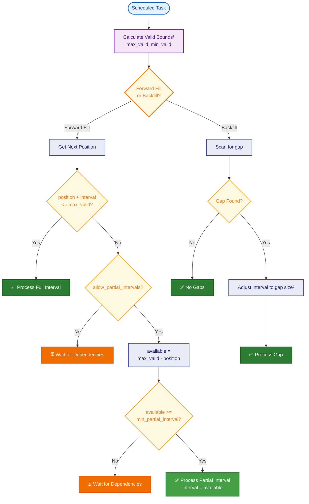

  <h1> CBT - ClickHouse Build Tool </h1>
</img>

A simple ClickHouse-focused data transformation tool that provides fast idempotent transformations with pure SQL or external scripts.

## Architecture

```
         ┌───────────────┐
         │      CBT      │
         └───────┬───────┘
                 │
        ┌────────┴────────┐
        │                 │
        ▼                 ▼
┌──────────────┐  ┌──────────────┐
│    Redis     │  │  ClickHouse  │
│              │  │              │
│ • Task Queue │  │ • Data       │
│ • Scheduling │  │ • Admin      │
└──────────────┘  └──────────────┘
```

**Multi-instance behavior:**
CBT runs as a unified binary that handles both coordination/scheduling and task execution. You can run multiple instances for high availability and increased throughput:
- All instances process transformation tasks from the queue unless filtered by tags in the `worker.tags` configuration.
- [Asynq](https://github.com/hibiken/asynq) prevents duplicate transformation tasks from being scheduled.


### Requirements

- ClickHouse
- Redis

## Configuration

CBT uses a single configuration file (`config.yaml`) for all settings.

### Default Configuration

Copy `config.example.yaml` to `config.yaml` and adjust for your environment:

```yaml
# CBT Configuration

# Logging level: panic, fatal, warn, info, debug, trace
logging: info

# Metrics server address
metricsAddr: ":9090"

# Health check server address (optional)
healthCheckAddr: ":8080"

# Pprof server address for profiling (optional)
# Uncomment to enable profiling
# pprofAddr: ":6060"

# ClickHouse configuration
clickhouse:
  # Connection URL (required)
  url: "clickhouse://localhost:9000"
  
  # Cluster configuration (optional, for distributed deployments)
  # cluster: "default"
  # localSuffix: "_local"
  
  # Admin table configuration (optional)
  # Defaults to admin.cbt if not specified
  # adminDatabase: admin
  # adminTable: cbt
  
  # Query timeout
  queryTimeout: 30s
  
  # Insert timeout
  insertTimeout: 60s
  
  # Enable debug logging for queries
  debug: false
  
  # Keep-alive interval
  keepAlive: 30s

# Redis configuration
redis:
  # Redis connection URL (required)
  url: "redis://localhost:6379/0"

# Scheduling settings
scheduler:
  # Maximum number of concurrent scheduling operations
  concurrency: 10
  
  # Admin table consolidation schedule (optional)
  # Controls how often the admin table is consolidated to optimize storage
  # Uses asynq cron format: @every duration, @hourly, @daily, or cron expression
  # Default: @every 10m
  consolidation: "@every 10m"

# Worker settings
worker:
  # Number of concurrent tasks to process
  concurrency: 10
  
  # Model tags for filtering which models this instance processes (optional)
  # Useful for running specialized instances for specific model types
  # tags:
  #   - "batch"
  #   - "analytics"

  # Seconds to wait for graceful shutdown
  shutdownTimeout: 30

# Models configuration (optional)
# Configure where to find external and transformation models
# Set default databases to use when models don't specify one
# Defaults to models/external and models/transformations if not specified
# models:
#   external:
#     defaultDatabase: ethereum # optional - models without 'database' field will use this
#     paths:
#       - "models/external" # default
#       - "/additional/external/models"
#   transformations:
#     defaultDatabase: analytics # optional - models without 'database' field will use this
#     paths:
#       - "models/transformations" # default
#       - "/additional/transformation/models"
```

## Models

Models define your data pipelines and should be stored in your own repository or directory.

### Database Configuration

The `database` field in model configurations can be:
- **Explicitly set**: When specified in the model, it takes precedence
- **Omitted**: Falls back to the `defaultDatabase` configured for that model type:
  - External models: Uses `models.external.defaultDatabase`
  - Transformation models: Uses `models.transformations.defaultDatabase`
- **Required**: If no default is configured, the database field must be specified in each model

This allows you to centralize database configuration while still having the flexibility to override it for specific models.

When referencing models in dependencies, you can use placeholders to reference the default databases:
- `{{external}}.table_name` - Resolves to the default external database
- `{{transformation}}.table_name` - Resolves to the default transformation database

This makes your models more portable and easier to maintain when database names change.

### Model Paths

By default, CBT looks for models in `models/external` and `models/transformations`. You can configure multiple paths for each model type in your `config.yaml`:

```yaml
models:
  external:
    paths:
      - "models/external"           # Default path
      - "/shared/models/external"   # Additional shared models
      - "/team/models/external"     # Team-specific models
  transformations:
    paths:
      - "models/transformations"    # Default path
      - "/shared/transformations"   # Shared transformations
```

### External Models

External models define source data boundaries. The `database` field can be omitted if a `defaultDatabase` is configured in the models configuration.

#### Template Variables

Models support Go template syntax with the following variables:

- `{{ .clickhouse.cluster }}` - ClickHouse cluster name
- `{{ .clickhouse.local_suffix }}` - Local table suffix for cluster setups
- `{{ .self.database }}` - Current model's database
- `{{ .self.table }}` - Current model's table
- `{{ .cache.is_incremental_scan }}` - Boolean indicating if this is an incremental scan
- `{{ .cache.is_full_scan }}` - Boolean indicating if this is a full scan
- `{{ .cache.previous_min }}` - Previous minimum bound (for incremental scans)
- `{{ .cache.previous_max }}` - Previous maximum bound (for incremental scans)

#### Example

```sql
---
database: ethereum  # Optional: Falls back to models.external.defaultDatabase if not specified
table: beacon_blocks
cache:  # Optional (strongly recommended): configure bounds caching to reduce queries to source data
  incremental_scan_interval: 10s  # How often to check for new data outside known bounds
  full_scan_interval: 5m          # How often to do a full table scan to verify bounds
lag: 30  # Optional: ignore last 30 positions of data to avoid incomplete data
---
SELECT 
    toUnixTimestamp(min(slot_start_date_time)) as min,
    toUnixTimestamp(max(slot_start_date_time)) as max
FROM `{{ .self.database }}`.`{{ .self.table }}` FINAL
{{ if .cache.is_incremental_scan }}
WHERE slot_start_date_time < fromUnixTimestamp({{ .cache.previous_min }})
   OR slot_start_date_time > fromUnixTimestamp({{ .cache.previous_max }})
{{ end }}
```

#### Cache Configuration

The `cache` configuration optimizes how CBT queries external data sources:

- **`incremental_scan_interval`**: Performs a lightweight query checking only for data outside the last known bounds. This avoids full table scans on large tables.
- **`full_scan_interval`**: Periodically performs a complete table scan to ensure accuracy and catch any data that might have been added within the previously known range.

When no cache exists (first run), a full scan is always performed. The cache persists in Redis without expiration, ensuring bounds are available even after restarts.

### Transformation Models

Transformation models process data in intervals. Intervals are agnostic to the source data and could be a time interval, a block number etc. The `database` field can be omitted if a `defaultDatabase` is configured in the models configuration.

> Note: CBT does not create transformation tables and **requires** you to create them manually by design.

#### Dependencies

Dependencies can reference other models using:
- **Explicit database references**: `database.table` (e.g., `ethereum.beacon_blocks`)
- **Default database placeholders**: 
  - `{{external}}.table` - References a table in the default external database
  - `{{transformation}}.table` - References a table in the default transformation database
- **OR groups**: `["option1", "option2", ...]` - At least one dependency from the group must be available

This allows models to reference dependencies without hardcoding database names:

```yaml
dependencies:
  - {{external}}.beacon_blocks                    # Required (AND logic)
  - ["source1.data", "source2.data"]              # At least one required (OR logic)
  - {{transformation}}.hourly_stats                # Required (AND logic)
  - ["backup1.blocks", "backup2.blocks", "backup3.blocks"]  # At least one required (OR logic)
  - custom_db.specific_table                       # Explicit database reference
```

The placeholders are replaced with actual database names from your configuration during model loading.

##### OR Dependency Groups

OR groups provide flexibility for:
- **Data source migration**: Seamlessly transition between old and new tables
- **Multi-provider redundancy**: Use data from different systems (e.g., different metrics providers)
- **Regional failover**: Automatically use available regional data sources
- **A/B testing**: Process data from multiple experimental sources

When CBT processes OR groups:
1. It checks each dependency in the group for availability
2. Selects the dependency with the best (widest) data range
3. Proceeds if at least one dependency is available
4. Fails only if none of the dependencies in the group are available

#### Template Variables

Models support Go template syntax with the following variables:

- `{{ .clickhouse.cluster }}` - ClickHouse cluster name
- `{{ .clickhouse.local_suffix }}` - Local table suffix for cluster setups
- `{{ .self.database }}` - Current model's database
- `{{ .self.table }}` - Current model's table
- `{{ .bounds.start }}` - Processing interval start
- `{{ .bounds.end }}` - Processing interval end
- `{{ .task.start }}` - Task start timestamp
- `{{ index .dep "db" "table" "field" }}` - Access dependency configuration

When using placeholder dependencies (e.g., `{{external}}.beacon_blocks`), you can access them in templates using either form:
- **Placeholder form**: `{{ index .dep "{{external}}" "beacon_blocks" "database" }}`
- **Resolved form**: `{{ index .dep "ethereum" "beacon_blocks" "database" }}`

Both forms work identically, allowing your templates to be portable across different database configurations.

#### Example

```sql
---
database: analytics  # Optional: Falls back to models.transformations.defaultDatabase if not specified
table: block_propagation
limits:               # Optional: position boundaries for processing
  min: 1704067200    # Minimum position to process
  max: 0             # Maximum position to process (0 = no limit)
interval:
  max: 3600          # Maximum interval size for processing
  min: 0             # Minimum interval size (0 = allow any partial size)
                     # min < max enables partial interval processing
                     # min = max enforces strict full intervals only
schedules:           # At least one schedule is required
  forwardfill: "@every 1m"  # How often to trigger forward processing
  backfill: "@every 5m"     # How often to scan for gaps to backfill
tags:
  - batch
  - aggregation
dependencies:
  - {{external}}.beacon_blocks  # Uses default external database
---
INSERT INTO
  `{{ .self.database }}`.`{{ .self.table }}`
SELECT 
    fromUnixTimestamp({{ .task.start }}) as updated_date_time,
    now64(3) as event_date_time,
    slot_start_date_time,
    slot,
    block_root,
    count(DISTINCT meta_client_name) as client_count,
    avg(propagation_slot_start_diff) as avg_propagation,
    {{ .bounds.start }} as position
FROM `{{ index .dep "{{external}}" "beacon_blocks" "database" }}`.`{{ index .dep "{{external}}" "beacon_blocks" "table" }}`
WHERE slot_start_date_time BETWEEN fromUnixTimestamp({{ .bounds.start }}) AND fromUnixTimestamp({{ .bounds.end }})
GROUP BY slot_start_date_time, slot, block_root;

-- Lazy delete deuplicate old rows (optional) to allow intervals to be re-processed
DELETE FROM
  `{{ .self.database }}`.`{{ .self.table }}{{ if .clickhouse.cluster }}{{ .clickhouse.local_suffix }}{{ end }}`
{{ if .clickhouse.cluster }}
  ON CLUSTER '{{ .clickhouse.cluster }}'
{{ end }}
WHERE
  slot_start_date_time BETWEEN fromUnixTimestamp({{ .bounds.start }}) AND fromUnixTimestamp({{ .bounds.end }})
  AND updated_date_time != fromUnixTimestamp({{ .task.start }});
```

### External Script Models

Models can execute external scripts instead of SQL. The script receives environment variables with ClickHouse credentials and task context.

> Note: CBT does not create transformation tables and **requires** you to create them manually by design.

#### Environment Variables

Environment variables provided to scripts:
- `CLICKHOUSE_URL`: Connection URL (e.g., `clickhouse://host:9000`)
- `BOUNDS_START`, `BOUNDS_END`: Bounds for processing
- `TASK_START`: Task execution timestamp
- `SELF_DATABASE`, `SELF_TABLE`: Target table info
- `DEP_<MODEL>_DATABASE`, `DEP_<MODEL>_TABLE`: Dependency info

#### Example

```yaml
database: analytics  # Optional: Falls back to models.transformations.defaultDatabase if not specified
table: python_metrics
interval:
  max: 3600          # Maximum interval size for processing
  min: 0             # Allow any size partial intervals
schedules:           # At least one schedule is required
  forwardfill: "@every 5m"
  backfill: "@every 5m"
tags:
  - python
  - metrics
dependencies:
  - {{external}}.beacon_blocks  # Uses default external database
exec: "python3 /app/scripts/process_metrics.py"
```

See the [example script](./example/scripts/entity_changes.py) for a the python script.

## Quick Start

### Try the Example

The example deployment demonstrates CBT's capabilities with sample models including SQL transformations, Python scripts, and tag-based filtering.

#### What's Included
- **External Models**: `beacon_blocks`, `validator_entity` (simulated data sources)
- **SQL Transformations**: 
  - `block_propagation` - Aggregates block propagation metrics
  - `block_entity` - Joins blocks with validator entities
  - `entity_network_effects` - Complex aggregation across multiple dependencies
- **Python Model**: `entity_changes` - Demonstrates external script execution with ClickHouse HTTP API
- **Data Generator**: Continuously inserts sample blockchain data
- **Chaos Generator**: Simulates data gaps and out-of-order arrivals for resilience testing

#### Running the Example

```bash
cd example

docker-compose up -d
```

#### Verify It's Working

```bash
# Check if models are processing
docker exec cbt-clickhouse clickhouse-client -q "
  SELECT table, COUNT(*) as rows 
  FROM system.tables 
  WHERE database = 'analytics' 
  GROUP BY table"

# View logs
docker-compose logs -f

# Check admin table for completed tasks
docker exec cbt-clickhouse clickhouse-client -q "
  SELECT database, table, COUNT(*) as runs 
  FROM admin.cbt 
  GROUP BY database, table"

# View task queue web UI
open http://localhost:8080  # Asynqmon dashboard
```

## Usage

### Running CBT

```bash
# Run CBT with default config.yaml
cbt

# Run with custom config
cbt --config production.yaml
```


### Admin Table Setup

CBT tracks completed transformations in an admin table for idempotency and gap detection. This table must be created before running CBT.

### Configuration

The admin table location is configurable in your `config.yaml`:

```yaml
clickhouse:
  url: http://localhost:8123
  # Optional: Custom admin table (defaults shown)
  adminDatabase: admin  # Default: "admin"
  adminTable: cbt       # Default: "cbt"
```

This allows running multiple CBT instances on the same cluster (e.g., `dev_admin.cbt`, `prod_admin.cbt`).

### Single-Node Setup

For single-node ClickHouse deployments:

```sql
-- Create admin database
CREATE DATABASE IF NOT EXISTS admin;

-- Create admin tracking table
CREATE TABLE IF NOT EXISTS admin.cbt (
    updated_date_time DateTime(3) CODEC(DoubleDelta, ZSTD(1)),
    database LowCardinality(String) COMMENT 'The database name',
    table LowCardinality(String) COMMENT 'The table name', 
    position UInt64 COMMENT 'The starting position of the processed interval',
    interval UInt64 COMMENT 'The size of the interval processed',
    INDEX idx_model (database, table) TYPE minmax GRANULARITY 1
) ENGINE = ReplacingMergeTree(updated_date_time)
ORDER BY (database, table, position);
```

### Clustered Setup

For ClickHouse clusters with replication:

```sql
-- Create admin database on all nodes
CREATE DATABASE IF NOT EXISTS admin ON CLUSTER '{cluster}';

-- Create local table on each node
CREATE TABLE IF NOT EXISTS admin.cbt_local ON CLUSTER '{cluster}' (
    updated_date_time DateTime(3) CODEC(DoubleDelta, ZSTD(1)),
    database LowCardinality(String) COMMENT 'The database name',
    table LowCardinality(String) COMMENT 'The table name',
    position UInt64 COMMENT 'The starting position of the processed interval',
    interval UInt64 COMMENT 'The size of the interval processed',
    INDEX idx_model (database, table) TYPE minmax GRANULARITY 1
) ENGINE = ReplicatedReplacingMergeTree(
    '/clickhouse/{installation}/{cluster}/{database}/tables/{table}/{shard}',
    '{replica}',
    updated_date_time
)
ORDER BY (database, table, position);

-- Create distributed table for querying
CREATE TABLE IF NOT EXISTS admin.cbt ON CLUSTER '{cluster}' AS admin.cbt_local
ENGINE = Distributed(
    '{cluster}',
    'admin',
    'cbt_local',
    cityHash64(database, table)
);
```

### Using Custom Admin Tables

If you need to use a different database or table name:

1. Update your `config.yaml`:
```yaml
clickhouse:
  adminDatabase: custom_admin
  adminTable: custom_tracking
```

2. Create the tables using your custom names:
```sql
CREATE DATABASE IF NOT EXISTS custom_admin;
CREATE TABLE IF NOT EXISTS custom_admin.custom_tracking (
    -- Same schema as above
);
```

### Monitoring Admin Table

Query the admin table to monitor progress, find gaps, or debug processing issues:

```sql
-- View model processing status
SELECT 
    database,
    table,
    count(*) as intervals_processed,
    min(position) as earliest_position,
    max(position + interval) as latest_position
FROM admin.cbt FINAL
GROUP BY database, table;

-- Find gaps in processing
WITH intervals AS (
    SELECT 
        database,
        table,
        position,
        position + interval as end_pos,
        lead(position) OVER (PARTITION BY database, table ORDER BY position) as next_position
    FROM admin.cbt FINAL
)
SELECT 
    database,
    table,
    end_pos as gap_start,
    next_position as gap_end
FROM intervals
WHERE next_position > end_pos;
```

## How CBT Ensures Data Consistency

CBT uses comprehensive dependency validation to ensure data consistency across your pipelines. Before processing any interval, the system validates that all required data is available:

### Dependency Validation Rules

CBT uses a sophisticated validation system to determine when a model can process data. The system calculates a valid processing range based on all dependencies, then checks if the requested interval falls within that range.

#### How Dependency Bounds Are Calculated

1. **External Models**: Query their min/max SQL to get available data range
   - If `lag` is configured: `adjusted_max = max - lag` (to avoid incomplete recent data)
   - These bounds are cached persistently with periodic updates based on the `cache` configuration

2. **Transformation Models**: Query the admin table for processed data range
   - `min`: First processed position (earliest data available)
   - `max`: Last processed end position (latest data available)

#### Valid Range Calculation

The valid range for a model is calculated using this formula:

```
min_valid = MAX(MIN(external_mins), MAX(transformation_mins))
max_valid = MIN(all dependency maxes)
```

##### Understanding min_valid Calculation

The minimum valid position combines two different behaviors:

**1. External Dependencies: MIN(external_mins)**
- External models represent source data (e.g., could be partitioned on time, block number etc. )
- Typically external models receive new data moving forward in time and assume no backfill
- We use MIN because we can start processing from when ANY external dependency source has data
- Example: If `blocks` starts at position 1000 and `transactions` starts at 900, we can begin at 900

**2. Transformation Dependencies: MAX(transformation_mins)**  
- Transformation models are derived data that may have gaps or incomplete history
- We use MAX because we need ALL transformation dependencies to have data before we can start
- Example: If `hourly_stats` starts at 1500 and `daily_summary` starts at 2000, we consider the available data starts at 2000

**3. Final Combination: MAX(external_min, transformation_max)**
- Takes the more restrictive of the two requirements
- Ensures both conditions are satisfied:
  - At least one external source has data (external_min)
  - All transformation dependencies have data (transformation_max)

##### Understanding max_valid Calculation

**MIN(all dependency maxes)**
- Much simpler: we must stop at the earliest endpoint of ANY dependency
- Doesn't matter if it's external or transformation - if any dependency runs out of data, we must stop
- This ensures we never try to process beyond what's available
- Example: If we have maxes of [5000, 4000, 4500], we stop at 4000

##### Why This Formula?

This approach reflects real-world data pipeline behaviors:
- **External sources** are typically reliable and continuous, rarely backfilling data
- **Transformations** may be incomplete, have processing gaps, or start at different times
- The formula ensures data consistency while allowing maximum flexibility in processing ranges

#### Configured Limits

After calculating the valid range from dependencies, configured limits are applied:

```yaml
limits:
  min: 1704067200  # Don't process before this position
  max: 1735689600  # Don't process after this position
```

Final range:
- `final_min = MAX(calculated_min, configured_min)`
- `final_max = MIN(calculated_max, configured_max)`

#### Validation Flow



**¹Valid Bounds Calculation:**
- `min = MAX(MIN(external dependency mins), MAX(transformation dependency mins))`
- `max = MIN(all dependency maxes)`
- Apply configured limits if present

**²Gap Adjustment:**
- `gap_size = position - min_valid`
- `adjusted_interval = MIN(gap_size, interval)`

#### Example Scenario: Standard Validation

Consider a model with these dependencies:
- External: `ethereum.blocks` (min: 1000, max: 5000, lag: 100)
- External: `ethereum.transactions` (min: 900, max: 4900)
- Transformation: `analytics.hourly` (min: 1500, max: 4500)
- Transformation: `analytics.daily` (min: 2000, max: 4000)

**Step-by-step calculation:**

1. **Apply lag to external models:**
   - `ethereum.blocks`: max becomes 4900 (5000 - 100 lag)
   - `ethereum.transactions`: max stays 4900 (no lag)

2. **Calculate min_valid:**
   - External mins: MIN(1000, 900) = 900 ← Can start when first external has data
   - Transformation mins: MAX(1500, 2000) = 2000 ← Need all transformations
   - Final: MAX(900, 2000) = 2000 ← More restrictive requirement wins

3. **Calculate max_valid:**
   - All maxes: [4900, 4900, 4500, 4000]
   - Final: MIN(all) = 4000 ← Stop at earliest endpoint

4. **Result:** Valid range is [2000, 4000]
   - Can't start before 2000 (waiting for `analytics.daily`)
   - Must stop at 4000 (where `analytics.daily` ends)

#### Example Scenario: Partial Interval Processing

Consider a transformation with:
- **Configuration**: `interval.max: 100`, `interval.min: 20` (partial intervals enabled when min < max)
- **Current position**: 1000
- **Dependency max_valid**: 1050 (only 50 units of data available)

**Processing decision:**

1. **Full interval check**: position (1000) + interval.max (100) = 1100 > max_valid (1050) ❌
2. **Partial interval enabled**: interval.min (20) < interval.max (100) ✅
3. **Available data**: max_valid (1050) - position (1000) = 50 units
4. **Minimum check**: available (50) >= interval.min (20) ✅
5. **Result**: Process partial interval of 50 units (positions 1000-1050)

Next cycle when dependencies have more data (e.g., max_valid reaches 1150), the transformation continues from position 1050.

### Key Validation Features

- **Pull-through validation**: Workers always verify dependencies at execution time, not just at scheduling
- **OR dependency groups**: Models can specify alternative dependencies using array syntax `["option1", "option2"]`, processing continues if at least one is available
- **Lag handling**: External models with `lag` configured have their max boundary adjusted during validation to ignore recent, potentially incomplete data
- **Coverage tracking**: The admin table tracks all completed intervals, enabling precise dependency validation
- **Automatic retry**: Failed validations are automatically retried on the next schedule cycle
- **Cascade triggering**: When a model completes, all dependent models are immediately (within 5 seconds) checked for processing
- **Partial interval processing**: When `interval.min < interval.max`, forward fill can process partial intervals based on available dependency data instead of waiting for full intervals. This reduces processing lag when dependencies are incrementally updating. Set `interval.min` to control the minimum acceptable chunk size, or use `interval.min = interval.max` to enforce strict full intervals only

This validation system ensures that:
1. No model processes data before its dependencies are ready
1. Processing can automatically resume when dependencies become available
1. Data consistency is maintained even in distributed environments

## License

MIT